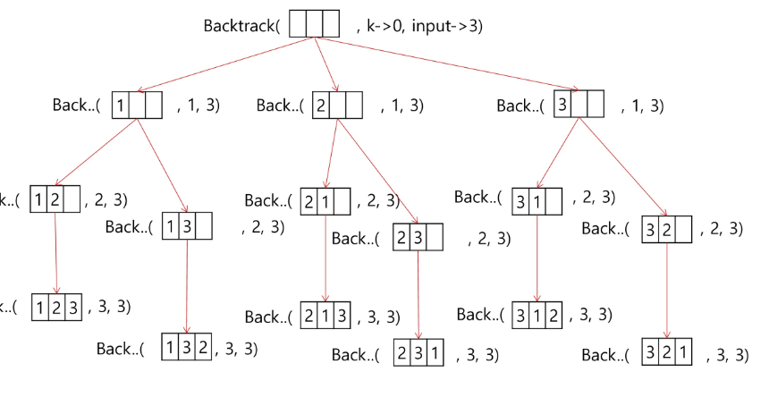
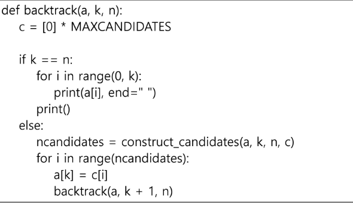

## 순열
- 동일한 숫자가 포함되지 않았을때, 각 자리수 별로 loop를 이용해 아래와 같이 구현할 수 있다.

for i1 in range(1,4):
    for i2 in range(1,4):
        if i2 != i1:
        for i3 in range(1,4):
            if i3 != i1 and i3 !=i2:
                print(i1,i2,i3)

- 백트래킹을 이용하여 {1,2,3 ...,NMAX}에 대한 순열 구하기

## 가지치기
- 집합 {1,2,3}의 원소에 대해 각 부분집합에서의 포함 여부를 트리로 표현
f(i,N): #인덱스 i 크기 N
if i==N:
    부분집합 끝
else:
    bit[i] = 1
    f(i+1,N)
    bit[i]=0
    f(i+1,N)

    for j in range(2):
    bit[i]=j
    f(i+1,N)

### 가지치기의 효용성
- 합을 메모제이션 해놓고 남은 원소를 고려할 필요가 없으면
- 재귀를 중단시키고 다른 가지로 뻗어감