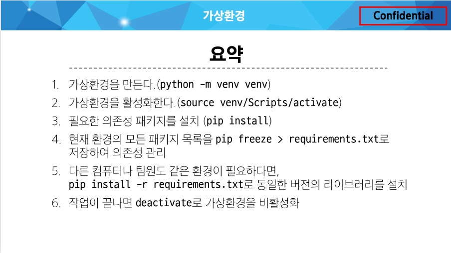

## 프레임워크 접근법

- 큰 틀과 흐름 이해
- 이미 만들어진 기능을 어떻게 활용,조합하는지 학습
- 구조를 이해하는게 중요
- 내부동작을 모두 이해할 필요보단
- "어떤기능이 어디에있고, 어떻게 활용할 수 있는지" 집중

### 최종적인 목표
1. 웹 애플리케이션
   - 로그인, 회원가입, 게시판, 댓글, 파일업로드

### 오늘 중요한것 가상환경

### 한번에 이해하려기보단 코드 중심으로 따라오기

1. 클라이언트와 서버
- 클라이언트가 요청을하면 서버는 응답을 한다.
  - 클라이언트: 서비스를 요청하는 주체
  - 서버: 클라이언트의 요청에 응답하는 주체
  - 요청이 있어야 응답이 있다.

2. 프론트엔드와 백엔드
   1. 프론트엔드
   - 사용자 인터페이스를 구성하고 사용자가 애플리케이션과 상호작용할 수 있도록 함
   1. 백엔드
   - 서버 측에서 동작하며 클라이언트의 요청에 대한 처리와 데이터베이스와의 상호작용 등을 담당

### 장고의 사용이유
- 다양성
  - 파이썬 기반으로 광범위한 서비스 개발 적합
- 확장성
  -  대량의 데이터에 대해 빠르고 유연함
- 보안
  - 기본 내장
- 커뮤니티 지원
  - 개발자를 위한지원

## 가상환경
1. 하나의 컴퓨터 안에서 독립적인 개발환경을 만들기 위해 필요.

### 파이썬 가상환경 만드는법
gitbash에서
1. python -m venv "venv(관례적인 폴더이름)"

2. venv폴더가 완성되면
    - source venv/Scripts/activate
    - 가상환경 활성화(mac/linux는 다름! Scripts대신 bin)
    - 끄려면 deactivate

3. 의존성 패키지- 프로젝트가 의존하는 개별 라이브러리들
   1. 패키지 목록 확인
    - pip list
   2. 의존성 기록
    - pip freeze > requirements.txt
    - 개발 환경이 팀원마다 다르기 때문에 환경을 동기화 하기위해 의존성 패키지를 기록한 문서를 남겨둔다.

### 가상환경 실행준비
1. 새로운 가상환경 활성화
2. requirements.txt로부터 패키지설치
   - pip install -r requirements.txt

### 가상환경 주의사항
1. 가상환경에 들어가고 나오는 것이 아니라 사용할 python 환경을 on/off 전환으로 생각
2. 프로젝트마다 별도의 가상환경을 사용
3. 폴더venv는 gitignore폴더에 있어서 업로드 안됨

### 장고 프로젝트 생성
pip install django  : 장고 깔기
1. django-admin startproject "폴더이름" .- 점은 만들고 그 폴더 안에 들어가는 용도

2. 서버실행
   - python manage.py runserver

### django 의 디자인 패턴
- 디자인 패턴: 소프트웨어 설계에서 발생하는 문제를 해결하기 위한 일반적인 해결책
- MTV 디자인 패턴(model, template, View): 기존 MVC패턴과 똑같음

### 장고 프로젝트 구성
- 애플리케이션의 집합(DB설정, URL 연결, 전체 앱 설정등 관리)
- 여러 독립적으로 작동하는 기능 단위 모듈인 앱으로 구성

### 앱을 사용하기 위한순서
1. 앱 생성(앱의 이름은 복수형으로 지정하는것을 권장)
   - python manage.py startapp articles
2. 앱 등록
   - 프로젝트 폴더의 settings.py 파일에 INSTALLED_APPS 리스트 안에 앞에서부터 문자열로 '앱이름' 쓰기

### 구조
- settings.py: 프로젝트의 모든 설정 관리
- urls.py: 요청 들어오는 URL에 따라 이에 해당하는 적절한 views를 연결
- __init__.py: 해당 폴더를 패키지로 인식하도록 설정하는 파일
- asgi.py: 비동기식 웹 서버와의 연결 관련 설정
- wsgi.py: 웹 서버와의 연결 관련설정
- manage.py: Django 프로젝트와 다양한 방법으로 상호작용 하는 커맨드 라인 유틸리티

- admin.py: 관리자용 페이지 설정
- models.py : db와 관련된 모델을 정의 MTV의 M

- views.py: HTTP요청을 처리하고 해당 요청에 대한 응답을 반환 MTV의 V

주로 수정해야할 5가지
1. settings.py
2. urls.py
3. admin.py
4. models.py
5. views.py

### 동작순서
1. urls.py 에서 요청을 받음
2. view에서 요청을 분석
3. model이나 템플릿을 사용자에게 반환

### 작성법
1. URLs urlpatterns 에 path를 추가해줌
   - ex) path("앱이름/", views.함수이름),
2. 앱의 View 파일에서 함수를 정의
   - ex) def 함수이름(request):
            return render(request, "앱이름/index.html")
3. 앱 폴더 안에 templates 폴더 생성
4. templates 폴더 안에 "앱이름" 폴더 생성
5. 앱 폴더 안에 템플릿 파일 생성

### 복습
1. python -m venv venv 로 가상환경 만들기
2. source venv/Scripts/activate 로 가상환경 on
3. pip install django 장고 깔기 혹은 pip install -r requirements.txt 로 요구 패키지 전부설치
4. django-admin startproject "프로젝트이름" . 으로 프로젝트 생성
5. python manage.py runserver로 서버동작 확인
6. python manage.py startapp "앱이름(복수형)"으로 앱생성
7. 생성 후 프로젝트 폴더의 settings.py 에 INSTALLED_APPS에 문자열로 앱이름 등록
8. urls urlpatterns 에 경로 추가
   - path('함수이름/', views.index)
   - 주소/함수이름 으로 호출할 수 있음
9. 앱폴더에 templates폴더 생성후 그 안에 앱폴더 이름 폴더 생성, 그리고 그 안에 html파일 생성 
10. 앱의 views.py 에 index함수정의 
   - def index(request):
            return render(request, "앱이름/index.html)
앱이름 빼려면 templates 폴더내에서 앱이름 폴더 빼고 바로 하위에 index.html 생성

브라우저 요청-> urls.py에 요청 내용을 그 앱의view에 전달-> 전달받은 내용을 view에서 함수 찾음-> 함수 내에서 앱의 템플릿중 써진 파일 반환-> 브라우저가 다시 렌더링