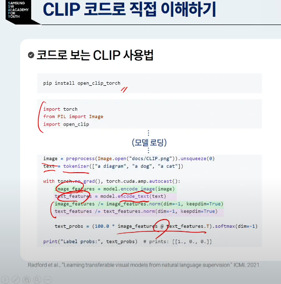

## 파운데이션모델

코드를 AI를 통해 만듦. 붙여놓는것도 AI가함
주석까지 자동완성됨

코파일럿은 doc 까지도 만들어주고 단위테스트 까지 만들어줌

### 응용사례- 에이전트
발표자료 만들기- 프롬프트를 제공해주면 ppt로 반환

컴퓨터 자동제어

### 파운데이션 모델이란?

기계학습 모델
예시: 뉴럴넷

입력->뉴럴넷->출력

파운데이션 모델
- 대규모 데이터를 폭넓게 먼저 학습, 다양한 문제에 빠르게 적응할 수 있는 범용 AI모델

트랜스포머 모델 + 대규모 언어 학습

멀티 모달(텍스트+오디오+비디오)등장하고있음

대개 비지도 학습으로 훈련된 모델이 주류

### 특징

- 활용 추가적인 미세조정
    - Zero-shot
    - Few-shot
    - Fine-tuning

높은 파인튜닝 성능
한정되지 않는 출력지원

CNN
- 이미지 처리에 주로 사용
- 정해진 정보이외 파악 어려움

트랜스포머 2017
- 기존 RNN, CNN 구조가 아닌 Attention 기법만 사용한 모델
- 데이터 간 복잡한 관계도 학습할 수 있으므로, 자연어처리 뿐 아니라 다양한 분야에서도 효과적

이후 GPT 
Generative: 생성형
Pretrained : 사전 학습된
Transformer: 트랜스포머 모델

로 나옴

CLIP
이미지 인코더와 텍스트 인코더 쌍을 측정 멀티모달 발전

### 활용법

1. 사전 학습

2. 이후에는 다양한 상황에 다음과 같이 활용

-> 문제를 바라보는 방식의 변화:
이제는 잘 학습된 모델들을 얼마나 잘 활용하느냐가 핵심

2. 어떤 파운데이션 모델이 내 문제에 가장 적합한가?

- 여러 모델을 같은 입력에 적용해보기

3. 학습 진행정도 비교

- zero shot
    - 예시 없이 질문만 던져서 문제해결
    - 사전학습된 모델의 배경지식 대응

- Few-shot
    - 예시 몇개를 함께 제시하여 문제 해결유도
    - 모델이 패턴을 스스로 감지하여 다음 입력에 적용

- Fine-tuning
    - 새 task에 맞춰 실제 추가학습진행
    - 리소스와 시간소모 큼

### Closed 언어 모델

ChatGPT
2022년 11월 30일 연구 프리뷰

사용자가 가장 많음

Claude
- 매우 긴 문맥기억
- 윤리적이고 올바른 출력을 생성하는것을 중요요소
- 사용자 만족도 높음
- Compute use 및 Model context protocol 에이전트 서비스 선제적으로 도입

Gemini
- 멀티모델 이해하도록 설계됨
- Google NotebookLM 에 통합된 기능이 유명

Grok3
- 유머러스한 대답

### Open Source 언어모델
- LLaMa
- 다양한 크기의 Transformer 기반 언어모델
- 파인튜닝모델(Vicuna, Alpaca)이 등장

Qwen
- 영어-중국어 이중언어에 최적화
- 기술적 완성도 높음

Mistral
- 파라미터 효율의 대표 사례 경량모델

DeepSeek
- 제한된 컴퓨팅 자원으로 고성능을 달성하도록 파라마터 효율 대표사례

- 오픈 소스 모델 중 처음으로 클로즈모델수준의 추론 성능근접

Phi (Microsoft)
- 코파일럿 등 온디바이스 AI에 활용
네이버 clova

ExaONE - LG

SOLAR (upstage)

### 바이브 코딩

Cursor
- 사용자가 원하는 AI를 선택해서 코드를 수정
- Codebase 전체를 VectorDB에 저장해두었다가 참고해서 코드를 생성하는 RAG활용
- 여러 파일을 동시에 수정하는 Composer 제공
- 웹상의 해결법 제시

- 유닛 테스트 생성: 함수명과 변수명 등을 고려해야함

### 음성인식모델
Whisper
- 자동 음성 인식: 높은 정확도로 입력 음성에 대한 자막생성
- 다양한 언어와악센트,잡음 등에도 높은 인식

CLAP
- 오디오와 텍스트의 학습관계

Stable Audio

Audiobox
- 텍스트에서 음성 내레이션

AudioLDM2 사운드효과,배경음,음악,음성등 폭넓은 생성가능

### 트랜스포머 모델

AI모델을 만들기 위해 필요한것
1. 데이터
2. 모델
3. 손실 함수

RNN, CNN구조를 사용하지 않고 Attention 기법만 사용한 인코더-디코더 구조의 모델

작동원리
- 토큰이라는 단위의 입력
- 입력된 토큰 간의 관계성을 집중하는 Attention 메커니즘으로 구성
- L 길이의 입력 토큰은 D-차원 특징벡터의 배열로 형태로 입력

토큰화된 벡터 형태를 언어모델이 받고 텍스트를 출력

임베딩 레이어

- 입력 index들
- 출력 embedding 실수 벡터

출력된 실수 벡터는 Attention에 입력됨

- 예측을 위해 중요한 정보에 집중하는 방식
    - 전체를 한번에 고려하기 보다는 연관된 중요한 정보 위주로 집중

Self-attention
- 입력된 하나의 문장에 대해서 attention을 수행
- 관계를 분석

예시) 나는 커피를 좋아해

Query ,key, value로 분할
내적을 통해 점수 결과 판단

소프트맥스 함수를 이용해 내적을 하면 나온 유사도중 높은 갚을 출력

Multi-Head Attention

- self-attention을 여러 개 활용하는것
- 여러개의 연산을 통해 다시 출력

디코더

입력 데이터 행렬곱을 받아 높은 점수대로 
모델의 디코더에 순차적으로 넣어줌

- Masked-Self Attention

- 디코더의 경우, 특정 단어를 기준으로 아직 등장하지 않은 다음 단어들은 attention연산에 활용하면 안되기 때문에 이를 마스킹 처리하는 방식

Cross-attention
    - self-attention 과 다르게 인코더에서 얻은 key,value와 디코더에서 얻은 query로 연산 수행

### 트랜스포머 응용
- 트랜스포머의 디코더 구조만 사용하여 만든 언어모델

- Auto-regressive방식을 활용
    한개의 단어를 넣은다음 다음단어를 예측(스마트폰 문자예측과 유사)

- 장점: 자연스러운 문장 생성 가능
- 단점 : 병렬 처리가 어려워 학습 속도 저하가능

#### 왜 트랜스포머인가

- 스케일의 법칙
데이터가 많은 상황에서 모델사이즈와 학습데이터가 커질수록 성능이 높아짐

- 이중 트랜스포머는 스케일 법칙을 따르는 모델로 알려짐

### 언어모델 역사

문장예측, 문장완성 등

모델을 고려할 필요가 없어짐

다음 레벨의 AI 디자인 요소

세상의 지식을 학습시키는법
상황에 맞추어 작동하는 법
내재된 지식을 이끌어내는법

모델의 학습량을 더더욱 키워서
GPT3부터 Few-shot이 가능

현재 사고하는 방법이 나옴

Codex by OpenAi 2021

chain of thought

문제의 사고 추론을 fewshot에 적용시키면 확률이 높아짐

사람의 명령을 따르는 형태의 데이터에 특화(GPT3.5)

## 멀티모델과 응용

1. CLIP 모델

기존 모델은 학습한 데이터와 유사한 도메인에 대한 일반화 능력만 있었음

학습하지 않은 새로운 도메인의 데이터에 대해서도 좋은 성능을 발휘

특징
수많은 데이터(인터넷에서 수집된 4억개의 이미지-텍스트 쌍)

- 아이디어1
    alt의 텍스트로 매치

버트 형태의 인코더만 사용

대조 학습을 통해
각각의 임베딩을 뽑음
한줄의 높은 유사도만 남긴채 모델 결과를 정제

멀티모달 정합

- 공통된 임베이딩 벡터 공간을 연결
- 이미지의 시각적 정보를 텍스트 설명과 연관성확인,검색등에 활용

2. LLaVA: Language 모델과 Vision 인코더 모델을 결합한 비전 -언어 모델

텍스트와 이미지를 모두 이해하는 능력을 갖춤

리소스 효율적인 학습을 통해 적은 데이터와 자원으로도 높은 성능을 유지

사전학습과 어뎁테이션을 통해 만듦

이 모델을 가지고 가중치와 언어모델을 다시 파인튜닝함 FP16으로 정밀도 최적화를 통해 적은 메모리로 학습

GPT를 이용하여 COCO 이미지와 라벨 데이터들을 가지고 질의를 생성

-질의 타입: 대화, 자세한설명, 복잡한 추론

### 개별 뉴럴 모듈을 결합하는 디자인 패턴

파운데이션 모델을 활용한 대규모 학습 데이터셋

- 사람 대신, ChatGPT를 활용한 합성 학습 데이터셋 생성

### 파운데이션 모델 + Fine-tuning

미세조정을 통해 조금만 튜닝하는것

- 효율적인 모델 학습

1. 프롬프트 튜닝
    파운데이션 모델은 고정
    학습 가능한 프롬프트를 학습시킴
2. Adaptor 모듈 추가 학습(LoRA)

지식 증류 학습

- 사전학습된 고성능 모델을 선생으로 지식을 넘겨줌

### 다음 모델?
비디오 생성 모델을 통해 물리현상 이해

언어모델 + 검색증강생성

